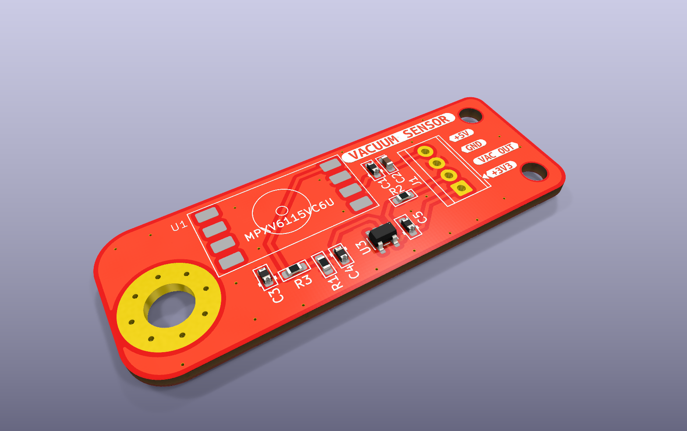
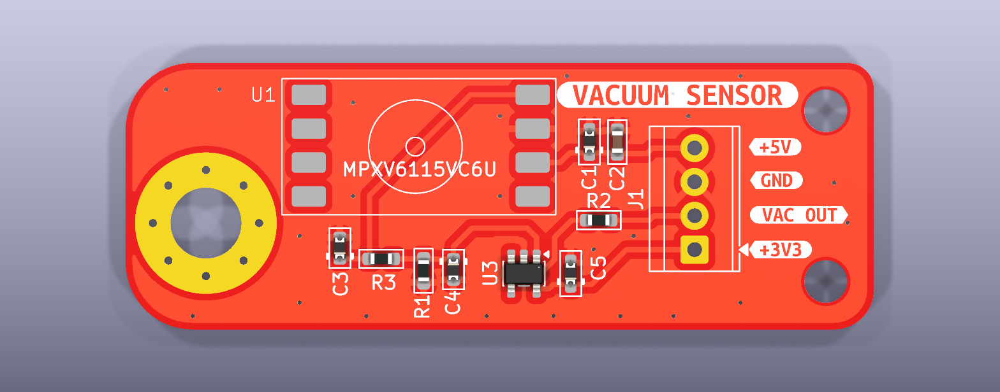
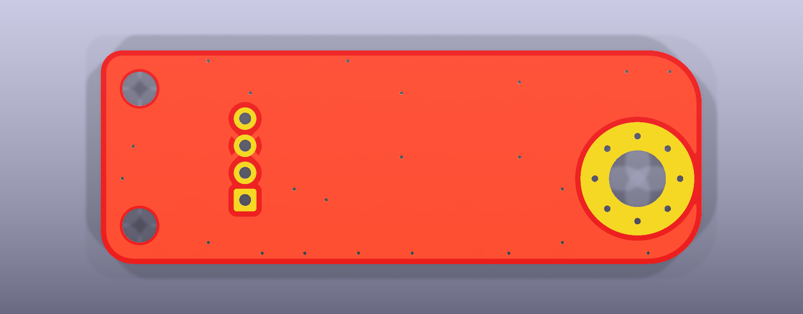
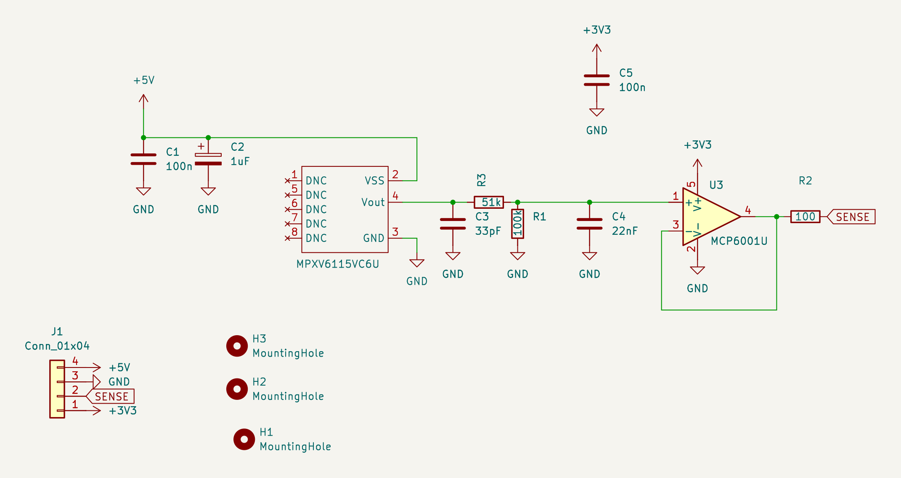

# LitePlacer Vacuum Sensor

Small analog vacuum-sensor board for a pick-and-place machine (LitePlacer-style, Smoothieboard v1.1 + OpenPnP 2.6).
It measures the vacuum at the nozzle so OpenPnP can check that a part was picked (*Part On*) and released (*Part Off*).

- **Sensor:** NXP/Freescale **MPXV6115VC6U** (−115…0 kPa, 5 V, ratiometric)
- **Buffer:** Microchip **MCP6001UT-I/OT** rail-to-rail op-amp powered from the Smoothie's 3.3 V, so the output can never exceed the ADC range
- **Output:** 0.2…3.05 V into a Smoothieboard thermistor input (P0.23 / T0), read with `M105`
- **Board:** 56 × 20 mm, 2 layers, 1.6 mm, M5 hole to mount it at the nozzle holder, 2 × M3 holes

Full design notes, calculations, bring-up, Smoothieware and OpenPnP configuration are in
[`vacuum-sensor.md`](vacuum-sensor.md).



## PCB

| Top | Bottom |
|---|---|
|  |  |

> The 3D renders show only the footprint pads for U1 (sensor) and J1 (terminal block), because those parts have no 3D model in the project.

## Schematic



Also available as [SVG](images/schematic.svg) and [PDF](images/schematic.pdf).

### How it works

```
MPXV6115V (5 V)  ──  R3 51k / R1 100k divider (×0.662)  ──  MCP6001U follower (3.3 V)  ──  R2 100 Ω  ──  Smoothie P0.23
4.6 V at atmosphere      + C3 33 pF, C4 22 nF (~210 Hz low-pass)                                          (T0 thermistor input)
0.2 V at full vacuum
```

- The sensor output reaches 4.6 V (up to ~4.8 V worst case), so the divider brings it down to ~3.05 V.
- The follower drives the Smoothie input with low impedance, so the board's 4.7 kΩ thermistor pull-up doesn't load the divider.
- Because the op-amp runs from the Smoothie's own 3.3 V, the ADC pin can't be over-driven.
- R2 isolates the op-amp output from the capacitance on the Smoothie input (prevents oscillation).

**Lower reading = more vacuum.**

## Connector J1

| Pin | Signal | Smoothieboard v1.1 |
|---|---|---|
| 1 (square) | +3V3 | 3.3 V pin of the VBB / 3.3V / GND connector |
| 2 | VAC OUT (SENSE) | P0.23 – T0 thermistor input, signal pin |
| 3 | GND | GND on the serial debug header |
| 4 | +5V | 5 V on the serial debug header |

> ⚠ The Smoothie's VBB / 3.3V / GND connector also carries **VBB (12–24 V motor supply)**. A wire on the wrong
> pin destroys the op-amp and probably the LPC1769. Check with a meter before powering up.

## Bill of materials

| Ref | Value | Package | Note |
|---|---|---|---|
| U1 | MPXV6115VC6U | SOP-8 (side port) | Pins 1, 5–8 must stay unconnected |
| U3 | MCP6001UT-I/OT | SOT-23-5 | Must be the **U** pinout (1 = VIN+, 4 = VOUT) |
| R3 | 51 kΩ 1 % | 0603 | Divider top |
| R1 | 100 kΩ 1 % | 0603 | Divider bottom |
| R2 | 100 Ω | 0603 | Output isolation resistor |
| C1 | 100 nF | 0603 | Sensor supply decoupling |
| C2 | 1 µF | 0603 | Sensor supply bulk |
| C3 | 33 pF | 0603 | Sensor output filter |
| C4 | 22 nF | 0603 | Low-pass with the divider (fc ≈ 210 Hz); 47 nF for ≈ 100 Hz |
| C5 | 100 nF | 0603 | Op-amp bypass |
| J1 | 4-pin terminal block, 2.54 mm | TE 282834-4 | |

> Reference designators here follow the KiCad design. `vacuum-sensor.md` uses the numbering from the original
> hand-wired prototype (there R1 = 51k, R2 = 100k, R3 = 100 Ω).

## Expected output

Sensor supply 5.0 V, reading from Smoothieware `ad8495` channel (`reading = V / 0.005`):

| Vacuum | Sensor out | Op-amp out | At Smoothie pin* | `V:` reading |
|---|---|---|---|---|
| 0 kPa (atmosphere) | 4.60 V | 3.05 V | 3.05 V | ≈ 610 (measured 614) |
| −40 kPa | 3.07 V | 2.03 V | 2.06 V | ≈ 410 |
| −60 kPa | 2.30 V | 1.53 V | 1.56 V | ≈ 310 |
| −80 kPa | 1.54 V | 1.02 V | 1.07 V | ≈ 215 |
| −115 kPa (full) | 0.20 V | 0.13 V | 0.20 V | ≈ 40 |

\* The Smoothie's 4.7 kΩ pull-up and R2 add a small linear offset; OpenPnP only compares readings, so it doesn't matter.

## Firmware and OpenPnP (short version)

Smoothieware `config`:

```
temperature_control.vacuum.enable          true
temperature_control.vacuum.sensor          ad8495
temperature_control.vacuum.ad8495_pin      0.23
temperature_control.vacuum.ad8495_offset   0
temperature_control.vacuum.designator      V
temperature_control.vacuum.heater_pin      nc
temperature_control.vacuum.max_temp        1000      # must be above 660, or Smoothie HALTs
```

OpenPnP actuator (Double): read command `M105`, read regex `.*V:(?<Value>-?\d+\.?\d*).*`,
set as the nozzle's *Vacuum Sense Actuator*.

The air line needs a **restriction** between the constantly running pump and the nozzle/sensor tee, otherwise the
reading is the same with the tip open or blocked. See §8b of [`vacuum-sensor.md`](vacuum-sensor.md) for measured
values and starting part-detection thresholds.

## Files

| File | Content |
|---|---|
| `liteplacer_vacuum_sensor.kicad_pro/.kicad_sch/.kicad_pcb` | KiCad project (KiCad 10) |
| `vacuum-sensor.md` | Full design and integration notes |
| `images/` | Renders and schematic exports |
| `1735222.pdf` | MPXV6115V datasheet (Freescale) |
| `DS_mpxv6115v6.pdf` | MPXV6115V6 datasheet (ST, second source) |

### Regenerating the images

```sh
kicad-cli pcb render -o images/pcb-top.png    --side top    --width 1600 --height 640 --quality high --zoom 1.9 liteplacer_vacuum_sensor.kicad_pcb
kicad-cli pcb render -o images/pcb-bottom.png --side bottom --width 1600 --height 640 --quality high --zoom 1.9 liteplacer_vacuum_sensor.kicad_pcb
kicad-cli pcb render -o images/pcb-iso.png    --side top --rotate '-40,0,30' --perspective --width 1600 --height 1000 --quality high --zoom 1.1 liteplacer_vacuum_sensor.kicad_pcb
kicad-cli sch export svg -o images --exclude-drawing-sheet liteplacer_vacuum_sensor.kicad_sch && mv images/liteplacer_vacuum_sensor.svg images/schematic.svg
kicad-cli sch export pdf -o images/schematic.pdf liteplacer_vacuum_sensor.kicad_sch
```
